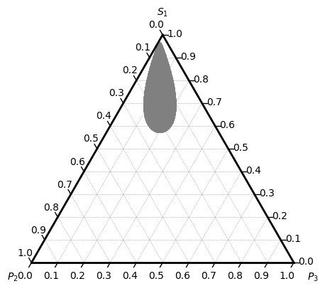

# ez-3pd
Quick and easy phase diagrams of 3 components

Evaluate phase diagram of ternary blend numerically[1] as shown in the example below[2]:

**Notes:**

- Currently only spinodal (unstable) regions are computed and visualized. Diagrams shown in Ref[2] are binodal regions.

- Since each component is independent with regard to each other, the program is trivially parallelized with OpenMP.

- The [python-ternary](https://github.com/marcharper/python-ternary) library is needed to plot the phase diagram. An example can be found in `test/plot-test3d.py`.

**Reference:**

[1] Horst, Roland. "Calculation of phase diagrams not requiring the derivatives of the Gibbs energy demonstrated for a mixture of two homopolymers with the corresponding copolymer." Macromolecular theory and simulations 4.3 (1995): 449-458.

[2] Bergfeldt, Karin, Lennart Piculell, and Per Linse. "Segregation and association in mixed polymer solutions from Flory− Huggins model calculations." The Journal of Physical Chemistry 100.9 (1996): 3680-3687.

TODO:

[ ] Calculate and visualize tie lines.